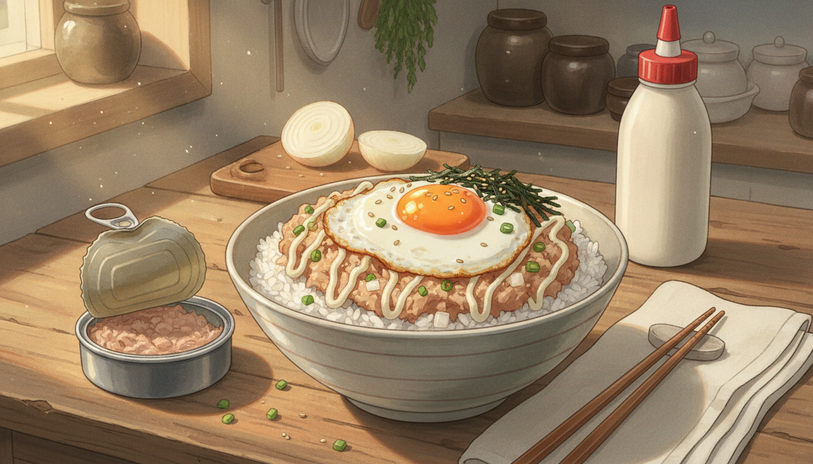

# 참치마요 덮밥 (10분)

참치캔 하나면 끝나는 자취 요리의 고전. 불은 계란 부칠 때만 잠깐 쓴다.
참치의 기름기를 꼭 짜고 마요네즈로 다시 살려내는 것이 맛의 전부.

- **조리 시간**: 10분
- **분량**: 1인분
- **난이도**: ★☆☆

---

## 재료

**기본**
- 따뜻한 밥 1공기 (약 200g)
- 참치캔 1개 (100g, 기름 뺀 것)
- 계란 1개
- 양파 1/4개, 잘게 다지기
- 식용유 1큰술

**소스**
- 마요네즈 2큰술
- 진간장 1작은술
- 설탕 1/2작은술
- 후추 약간

**고명 (선택)**
- 쪽파 1대, 송송 썰기
- 김가루 한 줌
- 스리라차 또는 마요네즈 지그재그
- 통깨 약간

---

## 만드는 법

### 1. 참치 기름 빼기 — 2분
캔 뚜껑을 반쯤 열어 젖힌 채 손으로 꾹 눌러 기름을 완전히 따라낸다.
체에 밭쳐 숟가락으로 눌러도 좋다.

> ⚠️ 기름을 남기면 마요네즈와 만나 느끼함이 두 배가 된다. 이 과정만은 대충 하지 말 것.

### 2. 양파 매운맛 빼기 — 1분
다진 양파를 찬물에 1분 담갔다가 키친타월로 물기를 꽉 짠다.
아삭한 식감은 남고 매운맛만 빠진다.

### 3. 참치마요 무치기 — 2분
볼에 참치, 양파, 마요네즈, 간장, 설탕, 후추를 넣고 포크로 으깨듯 섞는다.
참치 살이 절반쯤 부서지고 절반은 결이 남을 정도가 딱 좋다.

> 💡 간장은 색이 살짝 돌 만큼만. 짠맛보다 감칠맛을 더하는 역할이다.

### 4. 계란프라이 — 3분
팬에 식용유를 두르고 **중불**에서 계란을 반숙으로 부친다.
흰자 가장자리는 바삭하게, 노른자는 흐르게.

### 5. 완성 — 2분
그릇에 밥을 담고 참치마요를 소복하게 올린 뒤 계란프라이를 얹는다.
김가루, 쪽파, 통깨를 뿌리고 마요네즈를 지그재그로 짜 마무리.

---

## 먹는 법

노른자를 터뜨려 참치마요와 함께 밥에 비빈다.
김가루가 눅눅해지기 전에, 만든 즉시 먹는 것이 가장 맛있다.

---

## 변형 아이디어

| 추가 재료 | 넣는 시점 | 결과 |
|---|---|---|
| 스리라차 1작은술 | 3단계 무칠 때 | 매콤한 스파이시 마요 |
| 옥수수콘 2큰술 | 3단계 무칠 때 | 톡톡 터지는 단맛 |
| 슬라이스 치즈 1장 | 5단계 밥 위에 먼저 | 눅진한 치즈 덮밥 |
| 오이 1/3개 다지기 | 3단계 무칠 때 | 아삭하고 산뜻하게 |
| 밥 대신 식빵 2장 | 5단계 | 참치마요 샌드위치 |

---

## 실패하지 않는 팁

1. **기름은 완전히.** 참치캔 기름은 맛이 아니라 느끼함이다. 마요네즈가 그 자리를 대신한다.
2. **양파는 물기까지 짠다.** 물기가 남으면 무침이 질척해지고 밥이 진다.
3. **마요네즈는 2큰술부터.** 참치 브랜드마다 수분이 달라 더 넣기는 쉬워도 빼기는 불가능하다.
4. **김가루는 맨 마지막에.** 미리 뿌리면 습기를 먹어 눅눅해진다.
